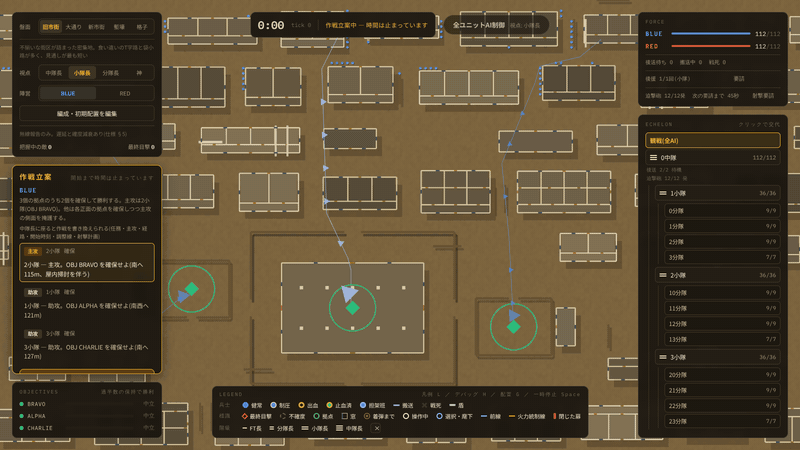
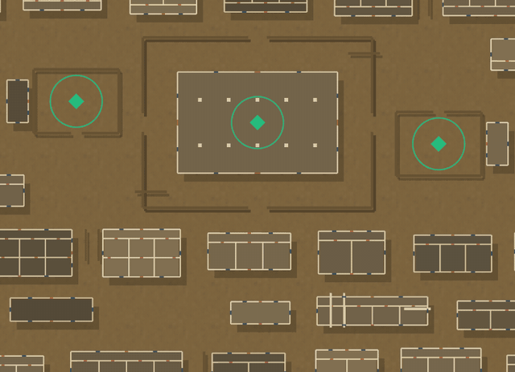
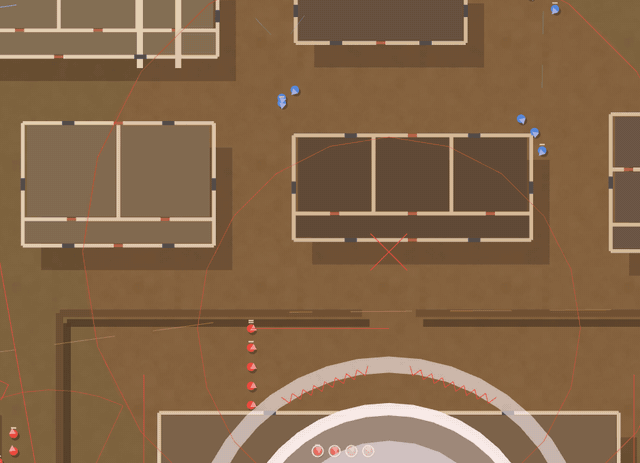
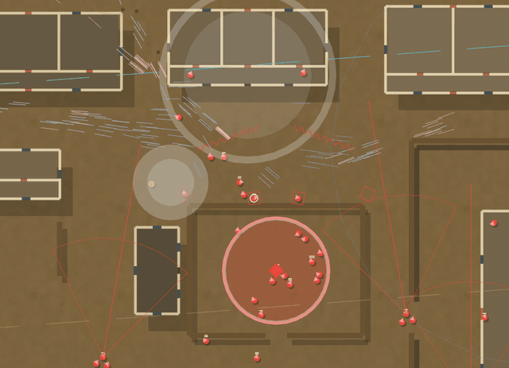

# ECHELON

[English](README.md) | **日本語**

**撃つのではなく、指揮するための見下ろし型・分隊戦術ゲーム。** 中隊・小隊・分隊・火力班・兵士
という5階層の指揮系統のどこにでも座り、下位の部隊に命令を出します。ほかのユニットはすべてAIが
動かし、人間もAIも、自分の階級に見合っただけの戦場の情報しか持てません。

ブラウザで動く、遊べるプロトタイプです。


## 見どころ

### どの部隊にも乗り換えられる

指揮系統ツリーの中隊・小隊・分隊のどれかをクリックすると、その部隊の指揮を取れます。分隊を選ぶとその下に
火力班と隊員が開き、火力班長や兵士1人にも乗り移れます。出せる命令は
AIが出すものと同じで、そのあいだも残りの部隊は戦い続けます。右クリックで移動命令を出し、いつでも
AIに指揮を返せます。


### 戦場全体から、兵士1人まで

全体の地図から、1人ひとりの兵士までズームできます。兵士は1人ずつ個別にシミュレーションされ、位置、
制圧、負傷、誰が誰を運んでいるかまで持っています。最大までズームして見えるのは演出ではなく、
戦闘の実際の状態です。


### 拠点を奪い合う

拠点は、その中に立つことで確保します。確保が進むと中心から薄い円が広がり、完了するとリングが
確保した側の色に変わります。両軍が拠点内にいるあいだは、確保は止まります。


### 負傷者は運び出される

被弾した兵士は負傷し、仲間の応急処置を受け、担架班によって負傷者集合点まで運ばれます。搬送中の
担架要員は撃てないので、負傷者が1人出るたびに、分隊の戦力も削られます。


### 指揮官に見えるのは、報告が伝えた情報だけ

兵士に見えるのは目の前のものだけ。分隊長には、麾下の火力班が見ているものが見えます。それより上は
すべて無線で届き、遅れ、不確かになり、1段上がるごとに大づかみになります。中隊長の戦況は、小隊長の
それより確実に古いものです。中隊長・小隊長・分隊長の視点を切り替えて、敵の見え方が変わるのを
試せます。

### 撃ち合いの前に、作戦を書き換える

戦闘は時間が止まった作戦立案から始まり、中隊長の作戦が表示されます。中隊長の座席に座れば、それを
書き換えられます。どの小隊を主攻にするか、各小隊の任務と開始時刻、経由点を通る経路、各小隊が揃って
越える調整線、迫撃砲の射撃計画。そのあとAIは、あなたが書いた作戦で戦います。



### ドローンの報告が届くのは中隊長だけ

中隊本部の無線手が小型ドローンを飛ばします。見えるのは真上から狭い円の中だけ(屋根の下と煙の中は
見えない)で、見たものは無線で遅れて中隊長に届きます。中隊長の戦況は新しくなりますが、前線の分隊の
戦況は古いままです。



### 待ち構える防御側

攻防戦では、防御側は地形だけから陣地を構えます。L字の待ち伏せは、攻撃側がキルゾーンに入るまで
動かず、入った瞬間に一斉に撃ちます。



### 陣地を壊すロケット

小銃分隊ごとに射手が1人、対戦車弾を2発持っています。命中すると着弾点まわりの兵士を倒し、その位置の
射撃壕や機関銃陣地を、遮蔽ごと壊します。



## 遊んでみる

[Node.js](https://nodejs.org/)(LTS)が必要です。

```sh
npm install
npm run dev
```

<http://localhost:5173/> を開きます。戦闘は時間が止まった立案フェーズから始まります。中隊長の作戦を
読んで、**戦闘開始**を押してください。中隊長に座れば、その作戦を書き換えてから始めることもできます。

コードに慣れていない方は、[`docs/はじめかた.md`](docs/はじめかた.md) にセットアップの手順があります
(Windows向け)。

### 操作

| やりたいこと | 操作 |
|---|---|
| 部隊に乗り換える | 右の指揮系統ツリーでクリック |
| AIに指揮を返す | ツリー最上段の **観戦(全AI)** をクリック |
| 移動命令を出す | 地図を右クリック |
| 迫撃砲を要請する(中隊長) | 右上の **射撃要請** → 撃つ地点をクリック |
| 発煙弾を焚く(分隊長) | 右上の **発煙** → 焚く地点をクリック |
| 対戦車火器を撃たせる(分隊長) | 右上の **対戦車** → 撃つ地点をクリック |
| ドローンを飛ばす(中隊長) | 右上の **ドローン** → 飛ばし先をクリック |
| 止まって構える(火力班長・兵士) | 右上の **停止・警戒** → 向く方向をクリック |
| 作戦を書き換える(中隊長・立案中) | 作戦立案パネルで任務・主攻・開始時刻を選ぶ / **経路を描く**・**調整線を引く**・**射撃計画を足す** → 地図をクリック |
| 防衛陣地を置き直す(攻防戦の防御側の中隊長・立案中) | 作戦立案パネルの陣地を選ぶ → 地図をクリック |
| 振り返り(AAR)・最初から再生 | `R` または時計バーの **AAR** |
| 兵士を選ぶ | 左クリック |
| 地図を動かす / 拡大縮小 | ドラッグ / マウスホイール |
| 一時停止 | `Space` |
| 凡例 / デバッグ / 配置エディタ | `L` / `H` / `G` |
| 盤面・視点・陣営を変える | 左上のパネル |

盤面は5つ。旧市街(狭い路地)、大通り(渡らなければならない幅40mの道)、新市街(段違いの長い街区)、
塹壕(2本の線のあいだの無人地帯)、格子(規則的な街区)です。規模は陣営ごとに分隊(9名)・小隊(36名)・
中隊(112名)から選べ(増援は別)、指揮の文化(ドクトリン)も陣営ごとに選べます。遭遇戦のほかに、防御側が
全拠点を持って始まり、時間切れまで守り切れば勝ちになる攻防戦があります。攻防戦の防御側は、機関銃陣地・
射撃壕・予備陣地・鉄条網・前進陣地・待ち伏せを置いた状態で戦闘を始めます。

## シミュレーションしているもの

- **5つの階層**。すべて実体の兵士がいます。小隊本部・中隊本部も倒され、その場合は指揮が下へ
  継承されます。
- **階級が上がるほど劣化する情報。** 兵士は見て、指揮官は麾下の見ているものを合算し、分隊より
  上は無線だけです。無線は5秒ごとの定時報告に加え、接敵・指揮官の交代・潰走はその場で臨時報告として上がります。見えていない敵の銃声は、方角とだいたいの距離だけの弱い接触になります。
- **移動の教範。** 通常移動、警戒移動、交互躍進を、真実ではなく指揮官の認識から選びます。隊形は
  通路の幅に合わせて変わります。
- **側面機動。** 分隊は基準班と機動班に分かれて敵を回り込み、小隊長は1個分隊で敵を拘束して
  別の分隊を敵線の端へ回します。
- **負傷から補充まで一貫した処理。** 被弾、戦死または負傷、出血、応急処置、担架搬送、集合点、
  後送、同じ職種での補充。
- **屋内戦(CQB)。** 建物と扉、屋内の細かい航行グリッド、積み → 突破 → フラッシュバン → 掃討 → 再編成。
- **発煙。** 視線だけを遮る煙。分隊長は、敵に見られながら開けた場所を渡るときに焚きます。
- **防衛計画。** 攻防戦の防御側の中隊長が、敵の位置を知らないまま地形だけで陣地を選びます。
  機関銃は射界の中だけを撃ち、射撃壕は窓と同じ遮蔽になり、鉄条網は人を止めて視線は通します。
  殺傷地帯に入るまで撃たない待ち伏せ、押されたら下がる前進陣地を置き、奪われた拠点には逆襲を出します。
- **士気と勝敗。** 火力班は崩れ、指揮継承が行われ、拠点で勝敗が決まります。
- **観測ドローン。** 中隊本部の無線手が飛ばす小型機。真下の狭い範囲を上から見ますが、見たものは
  無線で遅れて中隊長にだけ届きます。中隊長の像だけが新しくなり、前線の分隊の像は古いままです。
- **対戦車・対構造物火器。** 小銃分隊に1名の射手が2発持ち、窓・射撃壕・機関銃陣地にこもった敵を
  遮蔽ごと崩します(陣地は壊れます)。AI も人間も LLM も同じ規則で撃ちます。
- **中隊の資源。** 敵の本当の位置ではなく、中隊長が**そう信じている**位置へ撃つ60mm迫撃砲(AI・人間・
  LLM のどれでも、同じ規則で要請できます)と、中隊長が配分する後送車両。
- **振り返りとリプレイ。** 記録するのは命令だけ。初期条件コードと命令の記録から、同じ戦闘を最初から
  再生できます。振り返り画面では、各指揮官が信じていた敵の位置と実際の位置を時刻ごとに並べます。
- **オプション。** 盾持ち、増援、そして、指揮官の席に座って人間と同じ命令を出せるローカルLLM
  (LM Studio 経由)。

## 開発者向け

Vite、React、TypeScript、three.js、Zustand で作っています。

| コマンド | 内容 |
|---|---|
| `npm run dev` | アプリを起動 |
| `npm test` | ヘッドレスのシミュレーションテストを実行 |
| `npm run balance` | 職種のバランス表を表示(`npm run balance 5000` で戦闘回数を増やす) |
| `npm run llm` | ローカルLLM(LM Studio)に1階層を指揮させる(ヘッドレス戦闘。`-- --mock` でLLM無しの結線確認) |
| `npm run typecheck` | TypeScript の型検査 |
| `npm run lint` | ESLint |
| `npm run build` | 型検査と本番ビルド |

| パス | 内容 |
|---|---|
| `src/sim/` | シミュレーション本体。純粋で決定論的。three.js・React・DOM・`Math.random` は使わない。 |
| `src/render/` | three.js の見下ろし描画。世界を読むだけで、書き換えない。 |
| `src/ui/` | React のUIと Zustand のストア。 |
| `src/balance/` | シミュレーション自身の戦闘コードを使う、ヘッドレスのモンテカルロ・バランス検証。 |
| `src/llm/` | LLMの席。観測と命令のプロトコル、LM Studio クライアント。[`docs/LLM連携_設計.md`](docs/LLM連携_設計.md) を参照。 |
| `test/` | Vitest のテスト。決定性、戦力の対称性、サブシステムごとに1ファイル。 |
| `docs/ロードマップ.md` | ロードマップ。まだ無いものを優先度つきで一元管理。 |
| `docs/spec/` | 設計仕様。[`戦場指揮ゲーム_仕様書.md`](docs/spec/戦場指揮ゲーム_仕様書.md) が唯一の正本。コードのコメントにある §9 などの番号は、これを指します。 |
| `docs/media/` | このREADMEで使っているアニメーション。 |
| `prototypes/` | 元の単体Reactモック。参照用に残してある。 |

テストは2つの不変条件を守らせています。

- **戦力の対称性。** 陣営ラベルを入れ替えると、結果がぴったり反転しなければなりません。これは
  シミュレーションが `side` を一切読んでいない、つまりプレイヤーに有利な分岐が無いことの証明に
  なり、勝率の統計では混ざってしまう地形の有利とも切り分けられます。
- **決定性。** 同じシードなら同じ結果。乱数はすべて、陣営ごとに1本のシード付き乱数列を通します。

### まだ無いもの

予定しているがまだ作っていないもの(装甲車など)は、優先度つきで
[`docs/ロードマップ.md`](docs/ロードマップ.md) にまとめてあります。仕様書には、決まって実装済みのことだけを書きます。

## ライセンス

[MIT](LICENSE)
