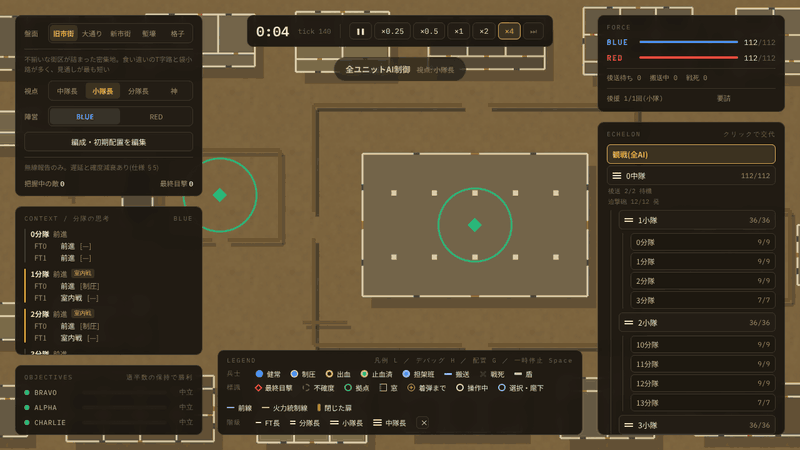
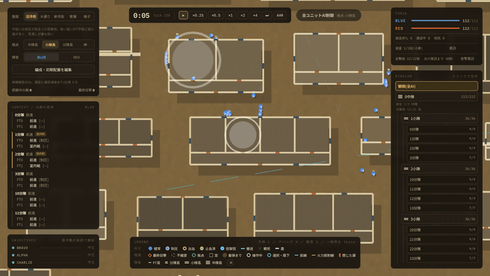
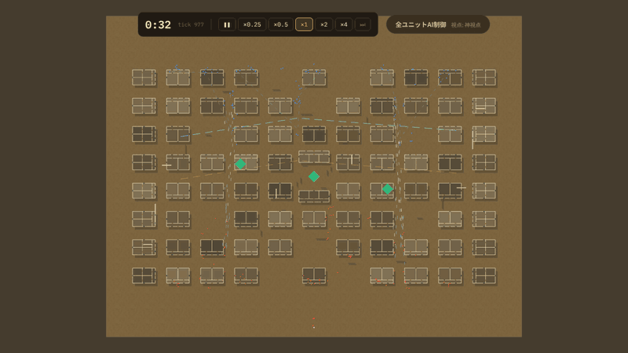
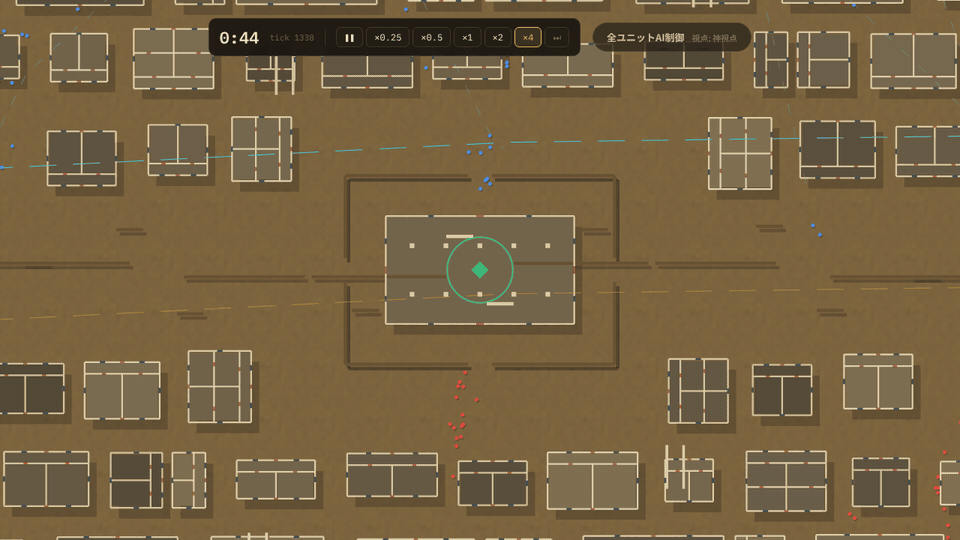
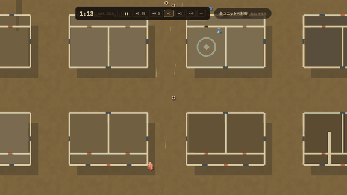

# ECHELON

**English** | [日本語](README.ja.md)

**A top-down squad-tactics game about commanding, not shooting.** Take a seat anywhere in a
five-tier chain of command — company, platoon, squad, fire team or soldier — and give orders to
the units below you. Every other unit is run by AI, and nobody, human or AI, sees more of the
battlefield than their rank would let them.

It runs in your browser. The project is a playable prototype.



## Highlights

### Take over any unit

Click any company, platoon or squad in the command tree and you are in charge of it. You get the
same orders the AI would give, and the rest of the force keeps fighting around you. Right-click
to send your unit somewhere; hand control back whenever you like.



### From the whole battlefield down to a single soldier

Zoom from the full map in to individual soldiers. Each one is simulated on its own — position,
suppression, wounds, who is carrying whom — so what you see at the closest zoom is the actual
state of the battle, not an animation.



### Fight over objectives

An objective is taken by standing in it. A pale disc grows from the centre as the capture
progresses, and the ring changes to the capturing side's colour when it is complete. If both
sides are inside, the count stops.



### Wounded soldiers are carried off

A hit soldier is wounded, gets first aid from a buddy, and is then carried by a litter team to a
casualty collection point. The bearers cannot fire while they carry, so every casualty also costs
the squad some fighting strength.



### Commanders only see what reports tell them

A soldier sees what is in front of them. A squad leader sees what their fire teams see. Above
that, everything arrives by radio — late, less certain, and vaguer at every step up. A company
commander's picture of the battle is measurably older than a platoon leader's. Switch between the
company, platoon and squad viewpoints and watch the enemy picture change.

## Play it

You need [Node.js](https://nodejs.org/) (LTS).

```sh
npm install
npm run dev
```

Open <http://localhost:5173/>. The battle begins in a planning phase with time stopped: read the
company commander's plan, then press **Start battle**.

If you do not work with code, [`docs/はじめかた.md`](docs/はじめかた.md) walks through setup step by
step (in Japanese, for Windows).

### Controls

| To do this | Do this |
|---|---|
| Take over a unit | Click it in the command tree on the right |
| Hand control back | Click **観戦(全AI)** at the top of the tree |
| Give a move order | Right-click on the map |
| Call a mortar mission (company commander) | **射撃要請** at the top right, then click the target |
| Throw smoke (squad leader) | **発煙** at the top right, then click the spot |
| Move a defensive position (defending company commander, while planning) | Pick it in the planning panel, then click the map |
| After-action review / replay from the start | `R` or **AAR** in the clock bar |
| Select a soldier | Left-click |
| Pan / zoom the map | Drag / mouse wheel |
| Pause | `Space` |
| Legend / debug panel / deployment editor | `L` / `H` / `G` |
| Change board, viewpoint or side | Panel at the top left |

The five boards are the Old Quarter (cramped alleys), the Boulevard (a 40 m avenue you have to
cross), the New Quarter (long staggered blocks), the Trenches (a no-man's-land between two lines)
and a regular Grid. Each side picks its own size — a squad (9), a platoon (36) or a company (112),
plus any reinforcements — and its own command doctrine. Besides the meeting engagement there is an
attack/defence mode, where the defender holds every objective until the clock runs out. The defender
starts that mode dug in, with machine-gun positions, fighting positions, alternate positions and
barbed wire.

## What is simulated

- **Five echelons**, each with real soldiers. Platoon and company headquarters can be killed, and
  command then passes down the chain.
- **Information that degrades with rank.** Soldiers see, leaders pool what their teams see, and
  everything above squad level is radio-only.
- **Movement doctrine.** Traveling, traveling overwatch and bounding overwatch, chosen from what
  the commander believes rather than from the truth. Formations adapt to corridor width.
- **Flanking.** Squads split into a base-of-fire team and a maneuver team that circles the enemy;
  platoon leaders pin the enemy with one squad and send another around the end of the line.
- **Casualties end to end:** hit, killed or wounded, bleed-out, buddy aid, litter carry,
  collection point, evacuation, and a replacement with the same specialty.
- **Close-quarters battle.** Buildings, doors and a finer navigation grid indoors; squads stack,
  breach, throw a flashbang, clear and reorganize.
- **Smoke.** Clouds that block sight and nothing else. Squad leaders throw one to cross open ground
  they are being watched over.
- **Defensive planning.** In attack/defence the defending company commander sites positions from
  terrain alone, without knowing where the attacker is. Machine guns fire only inside their sector,
  fighting positions give the same cover as windows, and wire stops people but not sight.
- **Morale and victory.** Fire teams can break, command succession is handled, and objectives
  decide the battle.
- **Company assets.** A 60 mm mortar that fires at what the company commander *believes*, not at
  where the enemy really is (the AI, a human and an LLM all request it under the same rules), and
  evacuation vehicles the commander has to share out.
- **After-action review and replay.** Only orders are recorded; the setup code plus that log replays
  the same battle from the start. The review screen sets each commander's belief about the enemy
  against where the enemy really was, moment by moment.
- **Optional extras.** Shield bearers, reinforcements, and a local LLM (through LM Studio) that
  can take a commander's seat and issue the same orders a human could.

## For developers

Built with Vite, React, TypeScript, three.js and Zustand.

| Command | What it does |
|---|---|
| `npm run dev` | Start the app |
| `npm test` | Run the headless simulation tests |
| `npm run balance` | Print the specialty balance table (`npm run balance 5000` for more battles) |
| `npm run llm` | Let a local LLM (LM Studio) command one echelon in a headless battle (`-- --mock` for a no-LLM wiring check) |
| `npm run typecheck` | TypeScript check |
| `npm run lint` | ESLint |
| `npm run build` | Typecheck and production build |

| Path | Contents |
|---|---|
| `src/sim/` | The simulation: pure and deterministic. No three.js, React, DOM or `Math.random`. |
| `src/render/` | The three.js top-down view. It reads the world and never changes it. |
| `src/ui/` | The React interface and Zustand store. |
| `src/balance/` | A headless Monte-Carlo balance harness that uses the simulation's own combat code. |
| `src/llm/` | The LLM seat: observation and command protocol, and an LM Studio client. See [`docs/LLM連携_設計.md`](docs/LLM連携_設計.md). |
| `test/` | Vitest specs: determinism, force symmetry, and one file per subsystem. |
| `docs/ロードマップ.md` | The roadmap: everything not yet built, with priorities. |
| `docs/spec/` | The design spec; [`戦場指揮ゲーム_仕様書.md`](docs/spec/戦場指揮ゲーム_仕様書.md) is the single source of truth. Section numbers such as §9 in code comments refer to it. |
| `docs/media/` | The animations used in this README. |
| `prototypes/` | The original standalone React mocks, kept for reference. |

Two invariants are enforced by the tests:

- **Force symmetry.** Swapping the side labels must invert the outcome exactly. That proves the
  simulation never reads `side`, so nothing favours the player, and it separates that from a
  terrain advantage, which a win-rate statistic would blur together.
- **Determinism.** The same seed gives the same result. All randomness goes through one seeded
  stream per force.

### Not yet built

Everything that is planned but not built — defensive tactics, editing the operation plan, drones,
armoured vehicles and more — is collected, with priorities, in [`docs/ロードマップ.md`](docs/ロードマップ.md)
(Japanese). The spec holds only what has been decided and built.

## License

[MIT](LICENSE)
